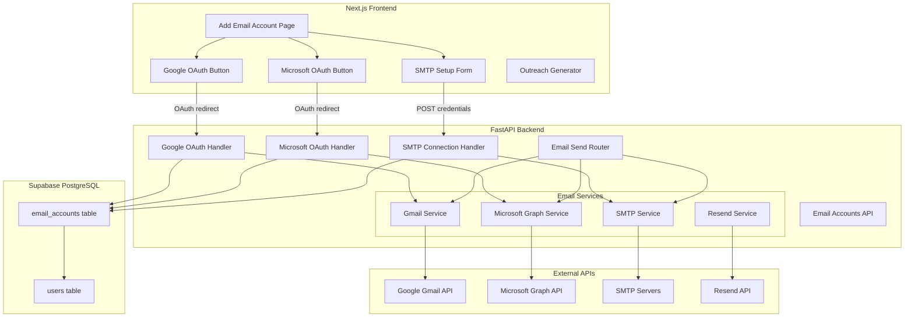

# 🏗️ Multi-Provider Email Outreach Architecture

> **Project:** AI Client Hunting & OutReach  
> **Stack:** Next.js (Frontend) + FastAPI (Backend) + Supabase (PostgreSQL)  
> **Date:** July 2026

---

## 📋 Table of Contents

1. [Overview](#overview)
2. [User Flow](#user-flow)
3. [Supported Email Providers](#supported-email-providers)
4. [Architecture Diagram](#architecture-diagram)
5. [Database Schema](#database-schema)
6. [Backend Implementation](#backend-implementation)
7. [Frontend Implementation](#frontend-implementation)
8. [Environment Variables](#environment-variables)
9. [Security & Encryption](#security--encryption)
10. [Implementation Phases](#implementation-phases)

---

## Overview

Users login to the platform, then connect their email account(s) for outreach. The system supports:

| Email Type | Integration | Examples |
|---|---|---|
| **Personal Gmail** | Gmail API (OAuth 2.0) | `user@gmail.com` |
| **Google Workspace** | Gmail API (OAuth 2.0) | `ceo@company.com` (G Suite) |
| **Personal Outlook** | Microsoft Graph API (OAuth 2.0) | `user@outlook.com`, `user@hotmail.com` |
| **Microsoft 365** | Microsoft Graph API (OAuth 2.0) | `sales@company.com` (M365) |
| **Hostinger / GoDaddy / Zoho / cPanel** | SMTP + IMAP Credentials | `info@company.com` |
| **Platform Emails** | Resend API | Verification, password reset, notifications |

---

## User Flow

```
User signs up → Email verification (via Resend) → Login → Dashboard
                                                          │
                                              "Add Email Account"
                                                          │
                               ┌──────────────────────────┼──────────────────────────┐
                               │                          │                          │
                      "Continue with Google"    "Continue with Microsoft"    "Other Provider (SMTP)"
                               │                          │                          │
                     Google OAuth Popup           Microsoft OAuth Popup        SMTP Setup Form
                               │                          │                          │
                     Tokens saved to DB           Tokens saved to DB        Credentials saved (encrypted)
                               │                          │                          │
                               └──────────────────────────┼──────────────────────────┘
                                                          │
                                                  Test Email Sent ✓
                                                          │
                                              Account Ready for Outreach
                                                          │
                                        User selects account → Sends outreach
```

### Decision: Personal ya Business?

Jab user "Add Email Account" pe click kare:

1. **Personal Email (Gmail/Outlook)** → OAuth flow — user apni email verify kare, tokens automatically save ho jayein
2. **Business Email (Hostinger/GoDaddy/Zoho)** → SMTP wizard — user SMTP host, port, email, password enter kare → test connection → ready

---

## Supported Email Providers

### 1. Gmail API (OAuth 2.0)

**Supports:** `@gmail.com`, `@googlemail.com`, Google Workspace domains

**Setup Requirements:**
- Google Cloud Console project
- OAuth 2.0 Client ID (Web Application type)
- Gmail API enabled
- OAuth consent screen configured
- Authorized redirect URI: `{BACKEND_URL}/api/v1/email-accounts/google/callback`

**Scopes needed:**
```
https://www.googleapis.com/auth/gmail.send
https://www.googleapis.com/auth/gmail.readonly
https://www.googleapis.com/auth/userinfo.email
https://www.googleapis.com/auth/userinfo.profile
```

**API Used:** Gmail REST API v1 (`googleapis.com/gmail/v1`)

### 2. Microsoft Graph API (OAuth 2.0)

**Supports:** `@outlook.com`, `@hotmail.com`, `@live.com`, Microsoft 365 domains

**Setup Requirements:**
- Azure Portal → App Registration
- Microsoft Graph API permissions
- Client ID + Client Secret
- Redirect URI: `{BACKEND_URL}/api/v1/email-accounts/microsoft/callback`

**Permissions needed:**
```
Mail.Send
Mail.Read
User.Read
offline_access
```

**API Used:** Microsoft Graph API v1.0 (`graph.microsoft.com/v1.0`)

### 3. SMTP Integration

**Supports:** Hostinger, GoDaddy, Zoho, Namecheap, cPanel, any email provider

**Common SMTP Settings:**

| Provider | SMTP Host | Port | IMAP Host | IMAP Port |
|---|---|---|---|---|
| Hostinger | `smtp.hostinger.com` | 465 (SSL) / 587 (TLS) | `imap.hostinger.com` | 993 |
| GoDaddy | `smtpout.secureserver.net` | 465 / 587 | `imap.secureserver.net` | 993 |
| Zoho | `smtp.zoho.com` | 465 / 587 | `imap.zoho.com` | 993 |
| Namecheap | `mail.privateemail.com` | 465 / 587 | `mail.privateemail.com` | 993 |
| cPanel | `mail.yourdomain.com` | 465 / 587 | `mail.yourdomain.com` | 993 |

### 4. Resend (Platform Emails Only)

**Usage:** ONLY for platform transactional emails (not outreach)
- Email verification
- Password reset
- Welcome emails
- Notifications

**Already configured** in current codebase via `RESEND_API_KEY`.

---

## Architecture Diagram



---

## Database Schema

### `email_accounts` Table (New)

```sql
CREATE TABLE email_accounts (
    id              UUID PRIMARY KEY DEFAULT gen_random_uuid(),
    user_id         UUID NOT NULL REFERENCES users(id) ON DELETE CASCADE,
    
    -- Account info
    provider        VARCHAR(20) NOT NULL,  -- 'google', 'microsoft', 'smtp'
    email_address   VARCHAR(255) NOT NULL,
    display_name    VARCHAR(100),
    
    -- OAuth tokens (for google/microsoft) — ENCRYPTED
    access_token    TEXT,
    refresh_token   TEXT,
    token_expires_at TIMESTAMPTZ,
    
    -- SMTP/IMAP credentials (for smtp provider) — ENCRYPTED
    smtp_host       VARCHAR(255),
    smtp_port       INTEGER,
    smtp_username   VARCHAR(255),
    smtp_password   TEXT,          -- encrypted
    imap_host       VARCHAR(255),
    imap_port       INTEGER,
    
    -- Status
    is_active       BOOLEAN DEFAULT TRUE,
    is_default      BOOLEAN DEFAULT FALSE,
    last_synced_at  TIMESTAMPTZ,
    connection_status VARCHAR(20) DEFAULT 'pending',  -- 'pending','connected','failed'
    
    -- Timestamps
    created_at      TIMESTAMPTZ DEFAULT NOW(),
    updated_at      TIMESTAMPTZ DEFAULT NOW(),
    
    UNIQUE(user_id, email_address)
);

CREATE INDEX idx_email_accounts_user ON email_accounts(user_id);
```

### SQLAlchemy Model

```python
# app/models/email_account.py
import uuid
from datetime import datetime
from typing import Optional
from sqlalchemy import String, Integer, Boolean, DateTime, Text, ForeignKey
from sqlalchemy.orm import Mapped, mapped_column, relationship
from sqlalchemy.dialects.postgresql import UUID
from app.db.base import Base, TimestampMixin

class EmailAccount(Base, TimestampMixin):
    __tablename__ = "email_accounts"

    id: Mapped[uuid.UUID] = mapped_column(UUID(as_uuid=True), primary_key=True, default=uuid.uuid4)
    user_id: Mapped[uuid.UUID] = mapped_column(UUID(as_uuid=True), ForeignKey("users.id", ondelete="CASCADE"))
    
    provider: Mapped[str] = mapped_column(String(20))        # google | microsoft | smtp
    email_address: Mapped[str] = mapped_column(String(255))
    display_name: Mapped[Optional[str]] = mapped_column(String(100), nullable=True)
    
    # OAuth tokens (encrypted)
    access_token: Mapped[Optional[str]] = mapped_column(Text, nullable=True)
    refresh_token: Mapped[Optional[str]] = mapped_column(Text, nullable=True)
    token_expires_at: Mapped[Optional[datetime]] = mapped_column(DateTime(timezone=True), nullable=True)
    
    # SMTP credentials (encrypted)
    smtp_host: Mapped[Optional[str]] = mapped_column(String(255), nullable=True)
    smtp_port: Mapped[Optional[int]] = mapped_column(Integer, nullable=True)
    smtp_username: Mapped[Optional[str]] = mapped_column(String(255), nullable=True)
    smtp_password: Mapped[Optional[str]] = mapped_column(Text, nullable=True)
    imap_host: Mapped[Optional[str]] = mapped_column(String(255), nullable=True)
    imap_port: Mapped[Optional[int]] = mapped_column(Integer, nullable=True)
    
    is_active: Mapped[bool] = mapped_column(Boolean, default=True)
    is_default: Mapped[bool] = mapped_column(Boolean, default=False)
    last_synced_at: Mapped[Optional[datetime]] = mapped_column(DateTime(timezone=True), nullable=True)
    connection_status: Mapped[str] = mapped_column(String(20), default="pending")
    
    # Relationship
    user = relationship("User", back_populates="email_accounts")
```

---

## Backend Implementation

### File Structure (New/Modified Files)

```
fastapi-backend/app/
├── api/v1/endpoints/
│   └── email_accounts.py          # NEW — OAuth flows + SMTP setup + CRUD
├── services/email/
│   ├── gmail_client.py            # MODIFY — per-user tokens instead of global
│   ├── microsoft_graph_client.py  # NEW — Microsoft Graph send/fetch
│   ├── smtp_sender.py             # EXISTS — already works
│   ├── resend_sender.py           # EXISTS — platform emails only
│   └── account_manager.py         # NEW — unified send/fetch router
├── models/
│   └── email_account.py           # MODIFY — add SQLAlchemy model
├── schemas/
│   └── email_account.py           # NEW — Pydantic request/response schemas
└── core/
    ├── config.py                  # MODIFY — add Google/Microsoft OAuth settings
    └── encryption.py              # NEW — Fernet encryption for tokens
```

### API Endpoints

```
# Email Account Management
GET    /api/v1/email-accounts/                    → List user's connected accounts
POST   /api/v1/email-accounts/test-smtp           → Test SMTP connection
POST   /api/v1/email-accounts/connect-smtp        → Save SMTP account
DELETE /api/v1/email-accounts/{account_id}         → Remove account
PATCH  /api/v1/email-accounts/{account_id}/default → Set as default

# Google OAuth
GET    /api/v1/email-accounts/google/auth-url      → Get Google OAuth URL
GET    /api/v1/email-accounts/google/callback       → Google OAuth callback

# Microsoft OAuth
GET    /api/v1/email-accounts/microsoft/auth-url    → Get Microsoft OAuth URL
GET    /api/v1/email-accounts/microsoft/callback     → Microsoft OAuth callback

# Outreach (Modified)
POST   /api/v1/outreach/send                        → Send via selected account
GET    /api/v1/outreach/smtp-status                  → Check connected accounts
```

### Google OAuth Flow (Backend)

```python
# 1. Generate Auth URL
@router.get("/google/auth-url")
async def google_auth_url(current_user = Depends(get_current_user)):
    params = urlencode({
        "client_id": settings.GOOGLE_CLIENT_ID,
        "redirect_uri": f"{settings.BACKEND_URL}/api/v1/email-accounts/google/callback",
        "response_type": "code",
        "scope": "https://www.googleapis.com/auth/gmail.send https://www.googleapis.com/auth/gmail.readonly https://www.googleapis.com/auth/userinfo.email",
        "access_type": "offline",
        "prompt": "consent",
        "state": str(current_user.id)  # pass user_id in state
    })
    return {"auth_url": f"https://accounts.google.com/o/oauth2/v2/auth?{params}"}

# 2. Handle Callback
@router.get("/google/callback")
async def google_callback(code: str, state: str, db = Depends(get_db)):
    # Exchange code for tokens
    token_response = requests.post("https://oauth2.googleapis.com/token", data={
        "code": code,
        "client_id": settings.GOOGLE_CLIENT_ID,
        "client_secret": settings.GOOGLE_CLIENT_SECRET,
        "redirect_uri": f"{settings.BACKEND_URL}/api/v1/email-accounts/google/callback",
        "grant_type": "authorization_code"
    })
    tokens = token_response.json()
    
    # Get user email from Google
    userinfo = requests.get("https://www.googleapis.com/oauth2/v2/userinfo",
        headers={"Authorization": f"Bearer {tokens['access_token']}"})
    email = userinfo.json()["email"]
    
    # Save encrypted tokens to DB
    account = EmailAccount(
        user_id=uuid.UUID(state),
        provider="google",
        email_address=email,
        access_token=encrypt(tokens["access_token"]),
        refresh_token=encrypt(tokens["refresh_token"]),
        token_expires_at=datetime.utcnow() + timedelta(seconds=tokens["expires_in"]),
        connection_status="connected"
    )
    db.add(account)
    await db.commit()
    
    # Redirect to frontend success page
    return RedirectResponse(f"{settings.FRONTEND_URL}/settings/email-accounts?connected=google")
```

### Microsoft OAuth Flow (Backend)

```python
# 1. Auth URL
AUTH_URL = "https://login.microsoftonline.com/common/oauth2/v2.0/authorize"
TOKEN_URL = "https://login.microsoftonline.com/common/oauth2/v2.0/token"

@router.get("/microsoft/auth-url")
async def microsoft_auth_url(current_user = Depends(get_current_user)):
    params = urlencode({
        "client_id": settings.MICROSOFT_CLIENT_ID,
        "redirect_uri": f"{settings.BACKEND_URL}/api/v1/email-accounts/microsoft/callback",
        "response_type": "code",
        "scope": "Mail.Send Mail.Read User.Read offline_access",
        "state": str(current_user.id)
    })
    return {"auth_url": f"{AUTH_URL}?{params}"}

# 2. Callback — same pattern as Google, exchange code for tokens, save to DB
```

### Microsoft Graph Email Sending

```python
# app/services/email/microsoft_graph_client.py
import requests

def send_email(access_token, to_email, subject, body, html_body=None):
    url = "https://graph.microsoft.com/v1.0/me/sendMail"
    headers = {"Authorization": f"Bearer {access_token}", "Content-Type": "application/json"}
    
    payload = {
        "message": {
            "subject": subject,
            "body": {"contentType": "HTML" if html_body else "Text", "content": html_body or body},
            "toRecipients": [{"emailAddress": {"address": to_email}}]
        }
    }
    
    response = requests.post(url, headers=headers, json=payload)
    return {"success": response.status_code == 202, "message_id": response.headers.get("x-ms-request-id")}

def refresh_access_token(client_id, client_secret, refresh_token):
    response = requests.post(TOKEN_URL, data={
        "client_id": client_id,
        "client_secret": client_secret,
        "refresh_token": refresh_token,
        "grant_type": "refresh_token"
    })
    return response.json()
```

### Unified Email Send Router

```python
# app/services/email/account_manager.py
async def send_via_account(account: EmailAccount, to_email, subject, body, html_body=None):
    """Route email sending through the correct provider based on account type."""
    
    if account.provider == "google":
        from app.services.email.gmail_client import send_email
        return send_email(
            client_id=settings.GOOGLE_CLIENT_ID,
            client_secret=settings.GOOGLE_CLIENT_SECRET,
            refresh_token=decrypt(account.refresh_token),
            from_name=account.display_name,
            to_email=to_email, subject=subject, body=body, html_body=html_body
        )
    
    elif account.provider == "microsoft":
        from app.services.email.microsoft_graph_client import send_email, refresh_access_token
        # Auto-refresh token if expired
        if account.token_expires_at < datetime.utcnow():
            new_tokens = refresh_access_token(
                settings.MICROSOFT_CLIENT_ID,
                settings.MICROSOFT_CLIENT_SECRET,
                decrypt(account.refresh_token)
            )
            account.access_token = encrypt(new_tokens["access_token"])
            # save to db...
        
        return send_email(
            access_token=decrypt(account.access_token),
            to_email=to_email, subject=subject, body=body, html_body=html_body
        )
    
    elif account.provider == "smtp":
        from app.services.email.smtp_sender import send_email
        return send_email(
            host=account.smtp_host, port=account.smtp_port,
            user=account.smtp_username, password=decrypt(account.smtp_password),
            from_name=account.display_name,
            to_email=to_email, subject=subject, body=body, html_body=html_body
        )
```

---

## Frontend Implementation

### New Pages

| Page | Path | Purpose |
|---|---|---|
| Email Accounts Settings | `/settings/email-accounts` | Manage connected email accounts |
| Add Email Account | `/settings/email-accounts/add` | Choose provider + connect |
| SMTP Setup Wizard | `/settings/email-accounts/smtp-setup` | SMTP credentials form |

### Add Email Account Page (UI Flow)

```
┌─────────────────────────────────────────────┐
│         Connect Your Email Account          │
│                                             │
│   Outreach emails apke inbox se jayengi     │
│                                             │
│  ┌─────────────────────────────────────┐    │
│  │  🔵 Continue with Google            │    │
│  │  Gmail, Google Workspace            │    │
│  └─────────────────────────────────────┘    │
│                                             │
│  ┌─────────────────────────────────────┐    │
│  │  🟦 Continue with Microsoft         │    │
│  │  Outlook, Hotmail, Microsoft 365    │    │
│  └─────────────────────────────────────┘    │
│                                             │
│  ┌─────────────────────────────────────┐    │
│  │  ⚙️  Other Email Provider (SMTP)    │    │
│  │  Hostinger, GoDaddy, Zoho, cPanel   │    │
│  └─────────────────────────────────────┘    │
│                                             │
└─────────────────────────────────────────────┘
```

### SMTP Setup Wizard

```
┌─────────────────────────────────────────────┐
│         Connect Business Email              │
│                                             │
│  Provider:  [ Hostinger ▼ ]                 │
│                                             │
│  ── SMTP Settings (Sending) ──              │
│  Host:      [ smtp.hostinger.com    ]       │
│  Port:      [ 587                   ]       │
│  Email:     [ info@company.com      ]       │
│  Password:  [ ••••••••••            ]       │
│                                             │
│  ── IMAP Settings (Receiving) ──            │
│  Host:      [ imap.hostinger.com    ]       │
│  Port:      [ 993                   ]       │
│                                             │
│  [  Test Connection  ]  [  Connect  ]       │
│                                             │
└─────────────────────────────────────────────┘
```

### Outreach Send — Account Selection

Jab user outreach email send kare, dropdown mein connected accounts show hon:

```
Send from: [ 📧 info@company.com (Hostinger) ▼ ]
             📧 john@gmail.com (Google)
             📧 sales@company.com (Microsoft 365)
             📧 info@company.com (Hostinger)  ✓
```

---

## Environment Variables

### New Variables (add to `.env`)

```env
# ── Google OAuth (for user email connections) ──────────────
GOOGLE_CLIENT_ID=your_client_id.apps.googleusercontent.com
GOOGLE_CLIENT_SECRET=GOCSPX-your_secret

# ── Microsoft OAuth ────────────────────────────────────────
MICROSOFT_CLIENT_ID=your_azure_app_client_id
MICROSOFT_CLIENT_SECRET=your_azure_app_secret
MICROSOFT_TENANT_ID=common

# ── Encryption Key (for storing tokens securely) ──────────
ENCRYPTION_KEY=your_32_byte_fernet_key_base64_encoded

# ── Backend URL (for OAuth callbacks) ─────────────────────
BACKEND_URL=https://your-backend.onrender.com
FRONTEND_URL=https://your-frontend.vercel.app
```

### Generate Encryption Key

```python
from cryptography.fernet import Fernet
print(Fernet.generate_key().decode())
```

---

## Security & Encryption

### Token Encryption (Fernet)

```python
# app/core/encryption.py
from cryptography.fernet import Fernet
from app.core.config import settings

_fernet = Fernet(settings.ENCRYPTION_KEY.encode())

def encrypt(plaintext: str) -> str:
    return _fernet.encrypt(plaintext.encode()).decode()

def decrypt(ciphertext: str) -> str:
    return _fernet.decrypt(ciphertext.encode()).decode()
```

### Security Rules

1. **OAuth tokens** — encrypted at rest in DB using Fernet
2. **SMTP passwords** — encrypted at rest in DB using Fernet
3. **Refresh tokens** — never exposed to frontend
4. **Access tokens** — auto-refreshed server-side when expired
5. **State parameter** — used in OAuth to prevent CSRF
6. **HTTPS only** — all OAuth callbacks must be HTTPS in production

---

## Implementation Phases

### Phase 1: Database & Models (Day 1)
- [ ] Create `EmailAccount` SQLAlchemy model
- [ ] Create Alembic migration
- [ ] Add `email_accounts` relationship to `User` model
- [ ] Create Pydantic schemas for request/response
- [ ] Implement `encryption.py` (Fernet encrypt/decrypt)

### Phase 2: SMTP Integration (Day 1-2)
- [ ] Build SMTP connection test endpoint
- [ ] Build SMTP account save endpoint
- [ ] Build SMTP setup wizard page (frontend)
- [ ] Add provider presets (Hostinger, GoDaddy, Zoho, etc.)
- [ ] Test with real Hostinger/GoDaddy account

### Phase 3: Google OAuth (Day 2-3)
- [ ] Set up Google Cloud Console project + OAuth credentials
- [ ] Build Google auth URL endpoint
- [ ] Build Google callback endpoint
- [ ] Modify `gmail_client.py` to use per-user tokens
- [ ] Build Google connect button (frontend)
- [ ] Test with personal Gmail + Google Workspace

### Phase 4: Microsoft OAuth (Day 3-4)
- [ ] Set up Azure App Registration
- [ ] Build Microsoft auth URL endpoint
- [ ] Build Microsoft callback endpoint
- [ ] Create `microsoft_graph_client.py` (send + fetch)
- [ ] Build Microsoft connect button (frontend)
- [ ] Test with Outlook + Microsoft 365

### Phase 5: Unified Send Router (Day 4-5)
- [ ] Create `account_manager.py` with `send_via_account()`
- [ ] Modify outreach `/send` endpoint to accept `account_id`
- [ ] Add account selector dropdown to outreach page
- [ ] Add auto-refresh logic for expired OAuth tokens
- [ ] Keep Resend for platform transactional emails only

### Phase 6: Polish & Testing (Day 5-6)
- [ ] Email accounts management page (list, delete, set default)
- [ ] Connection status indicators
- [ ] Error handling for expired/revoked tokens
- [ ] Rate limiting per provider
- [ ] End-to-end testing all 3 providers

---

## Python Dependencies (New)

Add to `requirements.txt`:

```
google-auth>=2.0.0
google-auth-oauthlib>=1.0.0
google-api-python-client>=2.0.0
msal>=1.20.0
cryptography>=41.0.0
httpx>=0.24.0
```

---

## Key Differences from Current System

| Aspect | Current | New Architecture |
|---|---|---|
| Email accounts | Single global config in `.env` | Per-user accounts in database |
| Gmail | One hardcoded refresh token | Each user connects their own Gmail |
| Outlook | Not supported | Full Microsoft Graph integration |
| SMTP | Single global config | Per-user SMTP connections |
| Resend | Used for outreach + platform | Platform transactional emails ONLY |
| Security | Tokens in plain `.env` | Fernet-encrypted in PostgreSQL |
| Account selection | Automatic (single) | User selects from dropdown |

---

> **Summary:** Is architecture se har user apni personal (Gmail/Outlook) aur business (Hostinger/GoDaddy/Zoho) dono emails connect kar sakta hai, exactly jaise Apollo, Instantly, aur Lemlist kaam karte hain. Resend sirf platform ke verification/notification emails ke liye rahega.
