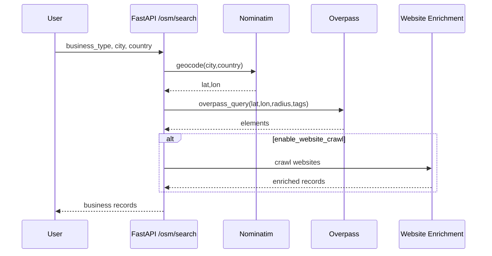
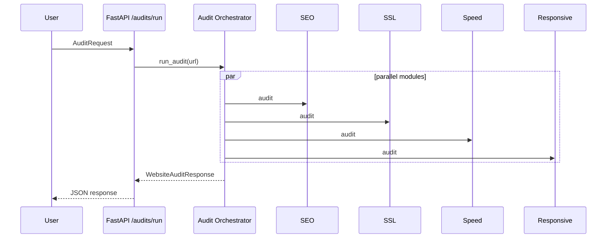

# 02 — Architecture and Flow

## 2.1 Architectural Style

The project follows a **layered architecture** with elements of **service-oriented design**:

- **Presentation layer**: Jinja2 templates + static assets for web pages (dashboard, businesses, audits, outreach, campaigns, inbox, settings).
- **API layer**: FastAPI endpoints under `/api/v1/...`.
- **Service layer**: domain services for OSM search, crawling, auditing, outreach generation.
- **Integration layer**: HTTP clients for external APIs (Overpass, LLM providers). Some integration stubs exist.
- **Persistence**:
  - current implementation: JSON files in `fastapi-backend/data/` for businesses/campaigns/threads/messages.
  - future-ready structure: SQLAlchemy models + repositories + migrations (placeholder files exist).

This structure is common in production systems because it:

- enforces separation of concerns,
- improves testability,
- isolates external dependency failures,
- supports incremental refactoring from file-based persistence to DB.

## 2.2 High-Level Components

### 2.2.1 FastAPI app server
- Entry point: `app/main.py`.
- Responsibilities:
  - create the ASGI application,
  - configure CORS,
  - mount static files,
  - render Jinja templates,
  - register routers.

### 2.2.2 API routers (v1)
Routers aggregate endpoint modules:

- `/health` — basic/detailed health checks
- `/osm` — business discovery and geocode
- `/audits` — run single/bulk/quick audits
- `/businesses` — list/save/update/delete; run audits; crawl sites
- `/outreach` — generate email, extract business data, run pipeline, send via SMTP
- `/campaigns` — create/manage campaigns (file-based)
- `/mail` — threads/messages for inbox-like UX (file-based)

### 2.2.3 Services
- OSM service wraps Overpass and enrichment.
- Website audit orchestrator runs submodules concurrently.
- Scraping service uses Playwright for JS-rendered sites.
- AI agent layer creates prompts and calls LLM provider(s) (some files are not readable through editor tooling in this environment; endpoints indicate their usage).

### 2.2.4 Workers (Celery)
The repo includes Celery worker scaffolding and tasks, but several task files are placeholders. The theoretical design is still described, because it is central to scalable pipelines:

- asynchronous audit runs,
- scheduled campaign sending,
- IMAP sync.

## 2.3 Data Flow Overview

### 2.3.1 Discovery flow

1. User submits business type + city + country.
2. Geocoder (Nominatim) resolves city center coordinate.
3. Overpass query fetches OSM elements.
4. Elements are normalized to business records.
5. Optional enrichment:
   - website crawl for contact details,
   - social links extraction.
6. Records returned to UI; user can save them.

### 2.3.2 Audit flow

1. User triggers audit (single URL or business website).
2. Orchestrator normalizes URL.
3. Modules run concurrently (thread pool): SEO/SSL/speed/responsiveness/social/image-alt.
4. Results are aggregated:
   - per-module score
   - flaws list
   - computed overall score
   - textual summary + recommendations

### 2.3.3 Outreach flow

1. User selects a business (or provides URL) and audit scores.
2. Business data is optionally extracted via AI.
3. Email writing agent generates:
   - subject variations
   - an email body
4. User sends via SMTP endpoint or uses inbox module.

## 2.4 Concurrency Model

The current codebase uses **ThreadPoolExecutor** inside async FastAPI endpoints to run synchronous workloads.

Why threads?

- Many operations are I/O-bound (HTTP requests, TLS handshakes, Playwright navigation).
- Running them synchronously inside the event loop blocks other requests.
- A thread executor allows FastAPI endpoints to stay responsive.

Design considerations:

- Use a bounded executor (`max_workers`) to avoid resource exhaustion.
- Use timeouts per operation (audit modules use 10–15s typical).
- Collect futures with robust exception capture (audit results include errors with score 0).

## 2.5 Reliability Patterns

### 2.5.1 Retries with exponential backoff
The OSM/Overpass client demonstrates:

- `Retry(total=..., backoff_factor=...)` for HTTP adapters.
- explicit loops with increasing sleep.

### 2.5.2 Fallback endpoints
- Multiple Nominatim servers.
- Multiple Overpass servers.

### 2.5.3 Fallback fetch strategies
- For SEO metadata: try `requests` first; fallback to Playwright if blocked.

### 2.5.4 Graceful degradation
- If one audit module fails, the orchestrator still returns a response with other module results.

## 2.6 Storage Strategy

### 2.6.1 Current (demo) storage
File-based JSON storage is used for:

- businesses
- campaigns
- email threads/messages

Benefits:

- simplest for a FYP demonstration,
- no DB setup required,
- data is human-readable.

Limitations:

- no concurrency safety (race conditions on write),
- poor query performance at scale,
- no relational integrity.

### 2.6.2 Future production storage
The repo includes a skeleton for SQLAlchemy models and repositories; a production design would:

- normalize business/campaign/email tables,
- store audit results with a schema version,
- store outbound messages with delivery status.

## 2.7 Security Boundary Model

Key boundaries:

- The backend holds secrets (SMTP password, API keys).
- The backend makes outbound connections to:
  - OSM servers,
  - business websites,
  - email servers,
  - LLM provider endpoints.

Threats include:

- SSRF risks when fetching arbitrary URLs,
- secret leakage via logs,
- spam abuse of SMTP sending endpoint.

Mitigations are discussed in the security chapter.

## 2.8 Sequence Diagrams (Conceptual)

### 2.8.1 OSM discovery

### 2.8.2 Website audit

## 2.9 Design Tradeoffs and Justifications

### 2.9.1 File storage vs database
For FYP, file storage reduces setup friction. For production, a DB is required.

### 2.9.2 Thread executor vs async HTTP
Using threads is pragmatic but less efficient than async HTTP clients.

- Threads are simple to integrate with synchronous libraries (requests, Playwright sync API).
- Async would reduce thread count and overhead but requires rewriting modules.

### 2.9.3 Auditing approach
The audit system uses **heuristics** rather than strict standards:

- simpler and faster,
- easy to interpret and explain to non-technical business owners,
- produces actionable recommendations.

## 2.10 Extendability

The architecture supports extension in multiple directions:

- Add new audit modules: accessibility (ARIA), Core Web Vitals via PageSpeed API, security headers.
- Add new discovery sources: Google Places, Yelp, business directories.
- Add campaign intelligence: schedule, segmentation, A/B testing.
- Add analytics: open tracking (with ethical considerations), response classification.

## 2.11 Summary

The system is designed as an end-to-end pipeline from discovery → enrichment → audit → generation → outreach. A layered architecture and modular auditing framework make it suitable for an academic project and extensible for future production improvements.
